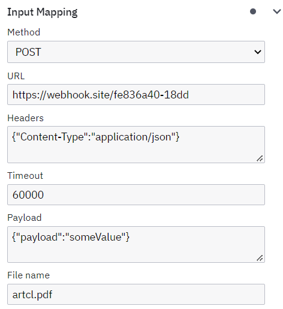

# Camunda 7 HTTP connector
HTTP Connector for Camunda 7

### Recommended Requirement:
- Maven: latest or 3.3.*+
- JDK:   1.8 (52)

## Deploying the HTTP Connector

```bash
git clone https://github.com/codot-pro/http-connector-c7
cd http-connector-c7
mvn clean install
```

After build, we can find .jar in ./target/ folder

## Run

#### Maven dependency
You can create a **Maven** project and add a **dependency** to run the connector

    <dependency>
        <groupId>com.codot.camundaconnectors.http</groupId>
        <artifactId>http-connector-c7</artifactId>
        <version>0.1.0-SNAPSHOT</version>
    </dependency>

#### Start SpringBootApplication
```bash
mvn exec:java -Dexec.mainClass="com.codot.camundaconnectors.http.Main"
```

#### Add .jar to Camunda 7 dir
After build, we can find .jar in ./target/ folder.
Place the .jar with other .jars and don't forget to add the missing libraries as needed.

## Connector template

To add a template to Camunda Modeler, you need to open the application
**modeler_root_folder/resources/element-templates** and put inside the template from
**http-connector-c7/element-templates** with the name **http-connector-c7.json**.

Reload the application, and you will be able to assign a template.

### Input data

- Method:
  - GET
  - POST
  - DELETE
>  If you choose the GET method, you cannot add a payload. You will get the error "java.lang.IllegalArgumentException: Cannot set a request body for HTTP method GET"
- URL
> Must be a valid url, including http/https, otherwise you will get an error "java.lang.IllegalArgumentException: Malformed URL: your.site/fe836a40/18dd"
- Headers/Payload
  - May be empty
  - Must be valid **(valid json syntax)**
  - (only for headers) Send headers as Map: {"Content-Type":"application/json", "Authorization":"your token", "headers":"value", ...}
- Timeout
  - Integer (ms)
- Response file name
  - Must always be specified
  - If the response is not a file, then the response will be written to the **response body**
- Attachments
  - for attach file: file1.pdf
### Output data

> It is important to fill in **all fields**
- Status code:
  - 400 - client error (Invalid headers/method)
  - 500 - server error
  - 504 - timeout error
  - other code returned by the server
- Status msg
- Response can be 
  - body (if it is possible to parse it)
  - file (it will be written to the TEMP directory with the specified file name)

### Debug mode
If you enable debug mode, then in the logs you will see logs with input and output data. They will be in the format [processDefinitionKey : processDefinitionVersion : currentActivityName : processInstanceId]: { output/input variables...}

## Example




